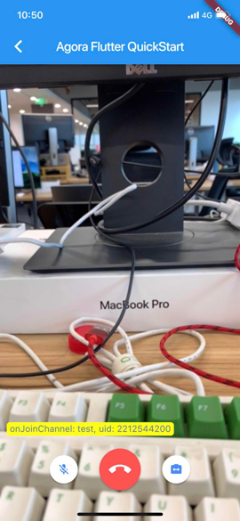

# Agora Flutter 快速入门

_Other languages： [English](README.md)_

本教程介绍如何使用[Flutter](https://flutter.io/)创建 Agora 帐户并使用 Agora 构建示例应用程序。

## 准备工作

- Agora.io [开发者帐户](https://dashboard.agora.io/signin/)
- [Flutter](https://flutter.io/) 1.0.0

## 快速开始

这个示例向您展示如何使用 Agora Flutter SDK 构建一个简单的视频通话应用程序。它向您展示了如何：

- 加入/离开频道
- 静音/取消静音
- 切换摄像头
- 布局多个视频视图




### 创建一个帐户并获取一个 App ID

要构建和运行示例应用程序，请首先获取 Agora App ID：

1. 在[agora.io](https://dashboard.agora.io/signin/)创建开发人员帐户。完成注册过程后，您将被重定向到仪表板页面。
2. 在左侧的仪表板树中导航到**项目** > **项目列表**。
3. 将从仪表板获取的 App ID 复制到文本文件中。您将在启动应用程序时用到它。

### 更新并运行示例应用程序

打开[settings.dart](lib/src/utils/settings.dart)文件并添加 App ID。

```dart
  const APP_ID ="";
```

在项目目录中运行`packages get`命令:

```shell
  #install dependencies
  flutter packages get
```

构建完成后，执行`run`命令启动应用程序。

```shell
  #start app
  flutter run
```

#### 我们建议您在开发期间按照 flutter 官方引导推荐，使用 IDE(包括但不限于 VS Code)来控制整体构建过程

有关如何设置 IDE 的详细信息，请参阅[此处](https://flutter.io/docs/get-started/editor?tab=vscode)

## 错误处理

### iOS 内存泄漏

如果你的 flutter channel 是 stable, `PlatformView` 会导致内存泄漏, 你可以运行 `flutter channel beta`

[你可以参考这条 pull request](https://github.com/flutter/engine/pull/14326)

### Android 黑屏

`提示：请确保你所有的配置都正确，但是仍然是黑屏`

如果你的 MainActivity 继承 `io.flutter.embedding.android.FlutterActivity`，并且你重写了 `configureFlutterEngine` 方法

请不要忘记添加 `super.configureFlutterEngine(flutterEngine)`

请不要添加 `GeneratedPluginRegistrant.registerWith(flutterEngine)`, 插件现在会自动注册

[你可以参考官方文档](https://flutter.dev/docs/development/packages-and-plugins/plugin-api-migration)

### Android Release 模式闪退

这个是代码混淆导致的，因为 flutter 默认设置了`android.enableR8=true`

在你的**app/proguard-rules.pro**文件中添加下面这行代码，以避免代码混淆：

```proguard
-keep class io.agora.**{*;}
```

## 附录

- 开发者中心[API 文档](https://docs.agora.io/en/)
- 如果发现了示例代码的 bug, 欢迎提交 [issue](https://github.com/AgoraIO/Agora-Interactive-Broadcasting-Live-Streaming-Web/issues)
- [Flutter lab：编写你的第一个 Flutter 应用程序](https://flutter.io/docs/get-started/codelab)
- [Flutter cookbook](https://flutter.io/docs/cookbook)
- [Flutter 在线文档](https://flutter.io/docs)，提供有关移动开发的教程，示例，指南以及完整的 API 参考。

## License

MIT
